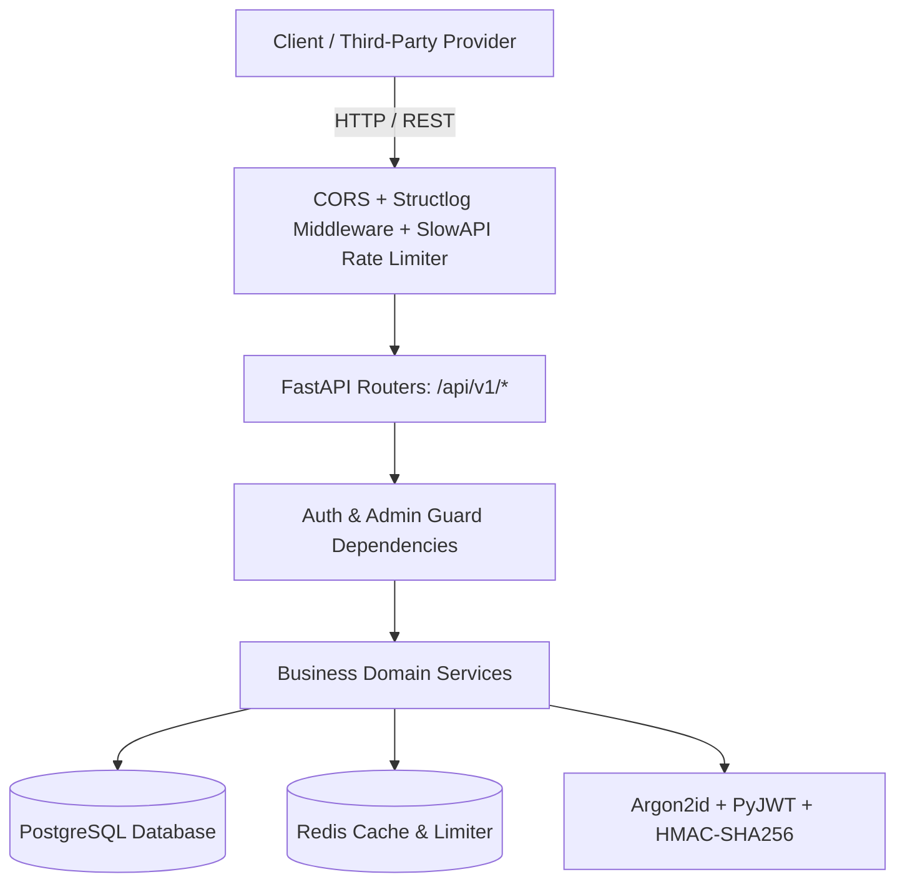
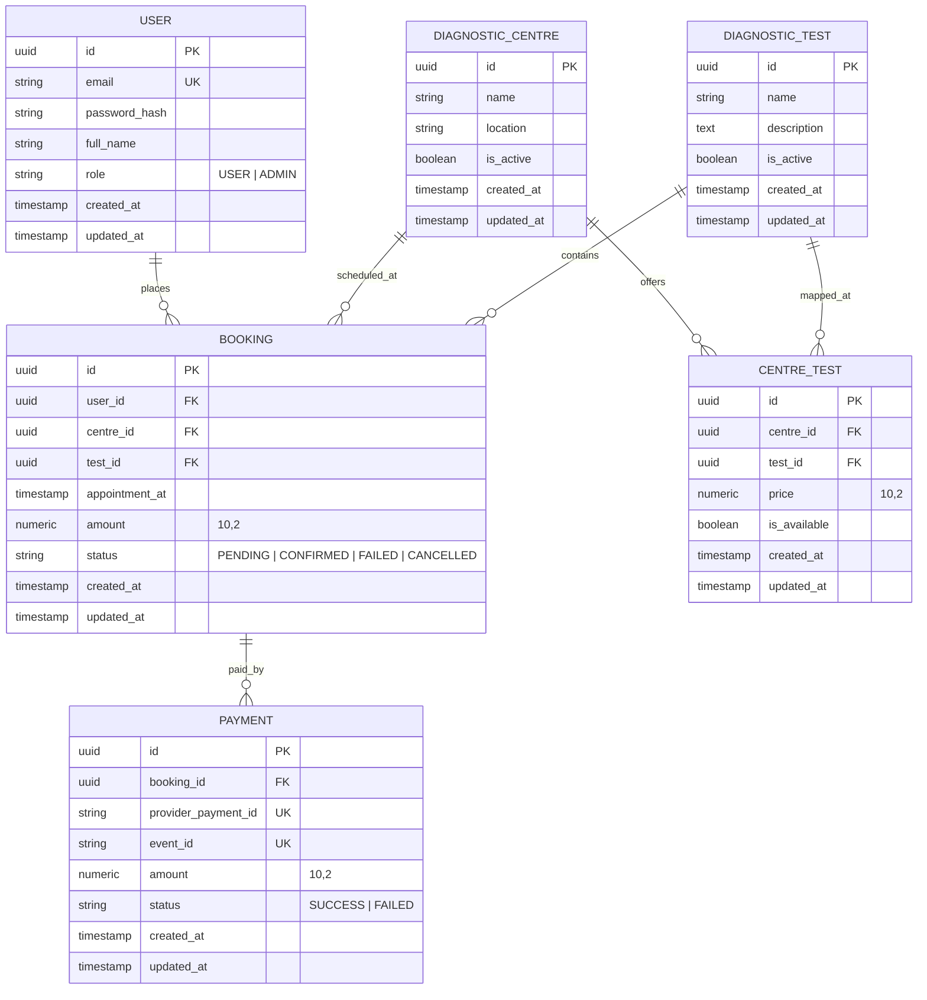
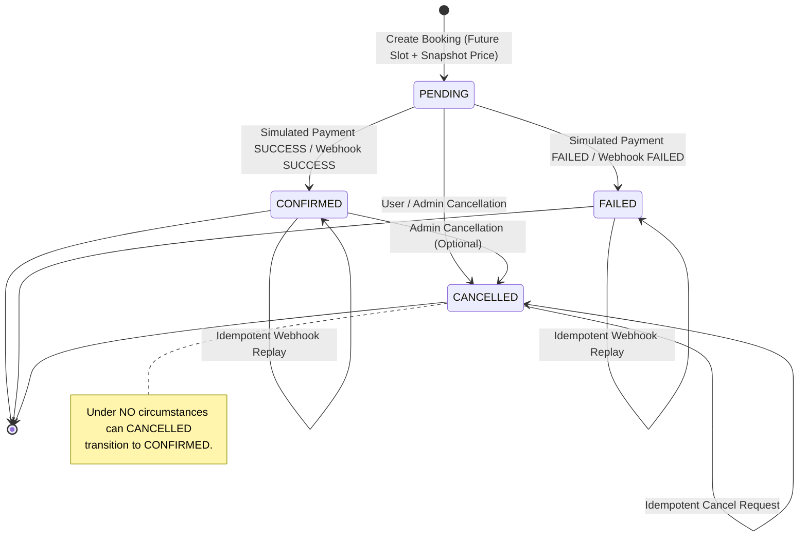
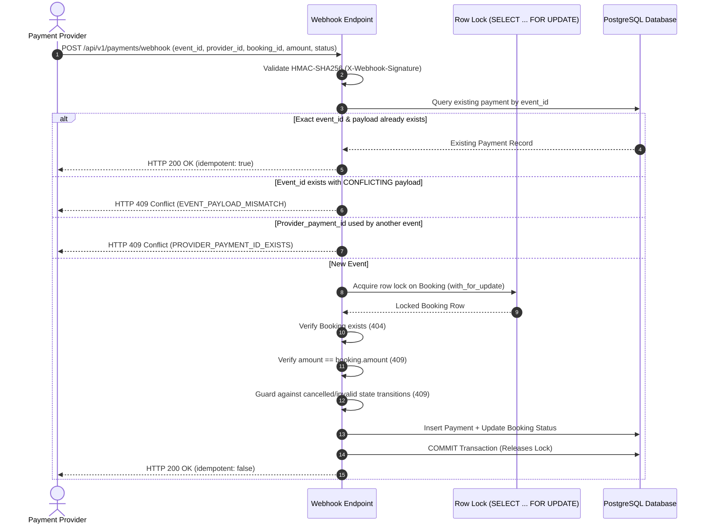

# DiagPay — Architecture & System Design Documentation

This document outlines the architectural patterns, data models, state machines, concurrency controls, and security guarantees implemented in the **DiagPay** backend service.

---

## 1. High-Level Architectural Overview

DiagPay follows a **Layered Service Architecture** with strict Separation of Concerns:

### Layer Responsibilities

1. **API Routers (`app/api/v1/`)**: Pure presentation layer. Parses requests, passes control to domain services, returns typed Pydantic responses with deliberate HTTP status codes. No database queries or business rules reside here.
2. **Business Services (`app/services/`)**: Encapsulates business logic, state machines, transactional integrity, price snapshots, and cache coordination.
3. **Database Models & Persistence (`app/models/`, `app/database.py`)**: SQLAlchemy 2.0 declarative models with `UUID`, `Numeric(10, 2)` monetary values, explicit foreign keys, indexes, and unique constraints.
4. **Caching Layer (`app/services/cache_service.py`)**: Redis-backed cache for read-heavy catalogue endpoints with graceful fallback to in-memory/direct DB queries if Redis becomes unavailable.
5. **Security & Utilities (`app/core/`)**: Argon2 password hashing, PyJWT tokens, HMAC webhook signature verification, and fixed-window rate limiting.

---

## 2. Database Schema & Entity Relationships

The data layer models diagnostic centres, test catalogues, centre-specific pricing mappings, patient bookings, and payment records.

### Critical Database Design Decisions

1. **Independent Test Pricing per Centre (`CENTRE_TEST`)**:
   - The same test (e.g., *Complete Blood Count*) has differing operating costs across diagnostic facilities. Test prices are deliberately **not** stored on the `DIAGNOSTIC_TEST` table.
   - `CENTRE_TEST` enforces `UniqueConstraint("centre_id", "test_id")`.
2. **Booking Amount Snapshot**:
   - The `BOOKING.amount` column takes an immutable snapshot of `CENTRE_TEST.price` at the moment of booking creation. Future price fluctuations do not alter historical booking amounts.
3. **No Floating-Point Arithmetic**:
   - Monetary values use SQL `NUMERIC(10, 2)` and Python `Decimal` to eliminate binary floating-point rounding errors.
4. **Active Slot Unique Constraint**:
   - Partial unique index `uq_bookings_active_user_slot (user_id, test_id, centre_id, appointment_at) WHERE status IN ('PENDING', 'CONFIRMED')` guarantees atomic database-level protection against simultaneous race conditions for active bookings while allowing re-booking if an appointment was previously CANCELLED.

---

## 3. Booking Lifecycle State Machine

### Valid & Invalid State Transitions

| From State | Allowed To States | Disallowed Transitions (HTTP 409) |
|---|---|---|
| **PENDING** | `CONFIRMED`, `FAILED`, `CANCELLED` | — |
| **CONFIRMED** | `CANCELLED` (Admin), `CONFIRMED` (Replay) | `FAILED` via stale webhook |
| **FAILED** | `FAILED` (Replay) | `CONFIRMED`, `CANCELLED` |
| **CANCELLED** | `CANCELLED` (Idempotent) | `CONFIRMED`, `FAILED` |

---

## 4. Webhook Idempotency & Concurrency Strategy

The payment webhook endpoint (`POST /api/v1/payments/webhook`) is guaranteed to be **idempotent**, **concurrency-safe**, and **tamper-evident**.

### Key Concurrency Mechanisms

1. **Unique Database Constraints**:
   - `uq_payment_event_id`: Ensures at most one record per provider webhook event.
   - `uq_payment_provider_payment_id`: Guarantees provider payment IDs are unique across transactions.
2. **Pessimistic Row Locking (`SELECT ... FOR UPDATE`)**:
   - When processing payment attempts or webhooks, the corresponding `Booking` row is locked inside the database transaction. Concurrent requests wait rather than creating race-condition double updates.
3. **Payload Parity Check**:
   - Replaying the identical event returns HTTP 200 without creating new records.
   - Sending an identical `event_id` with mutated fields (different booking, status, or amount) triggers **HTTP 409 Conflict** (`EVENT_PAYLOAD_MISMATCH`).

---

## 5. Caching & Cache Invalidation Strategy

Read-heavy catalog endpoints utilize Redis with proactive invalidation:

| Endpoint | Cache Key Pattern | TTL | Invalidation Trigger |
|---|---|---|---|
| `GET /api/v1/centres` | `centres:list:p{page}:s{page_size}:act{bool}` | 300s | Centre create/update/deactivate |
| `GET /api/v1/centres/{id}` | `centres:{id}` | 300s | Centre update/deactivate |
| `GET /api/v1/centres/{id}/tests` | `centres:{id}:tests:act{bool}` | 300s | Test mapped/updated/removed at centre |
| `GET /api/v1/tests` | `tests:list:p{page}:s{page_size}:act{bool}` | 300s | Test created/updated/deactivated |
| `GET /api/v1/tests/{id}` | `tests:{id}` | 300s | Test updated/deactivated |

### Graceful Degradation
If Redis crashes or is not configured:
- `CacheService` catches connection exceptions, logs warnings, and passes requests directly to PostgreSQL.
- Rate limiting falls back to an in-memory storage strategy.
- `/health` reports Redis as `"degraded"` while the application continues serving traffic normally.

---

## 6. Security Model

1. **Argon2id Hashing**: Industry-standard Argon2 hashing with salt and memory-hard computation via `argon2-cffi`. Plaintext passwords are never logged or stored.
2. **Role-Based Access Control (RBAC)**:
   - `USER`: Can browse catalogues, book tests, view own bookings, simulate payments for own bookings.
   - `ADMIN`: Full catalogue management (centres, tests, test-pricing mappings), can cancel any booking, view all system bookings.
3. **JWT Access Tokens**: Cryptographically signed with HMAC-SHA256, expiration timestamps, and subject identifiers.
4. **HMAC Webhook Verification**: `X-Webhook-Signature` uses constant-time `hmac.compare_digest` to prevent timing attacks.
5. **No Information Leakage**: Exception handlers sanitize internal database tracebacks and format all error responses consistently as `{"detail": "...", "code": "..."}`.
